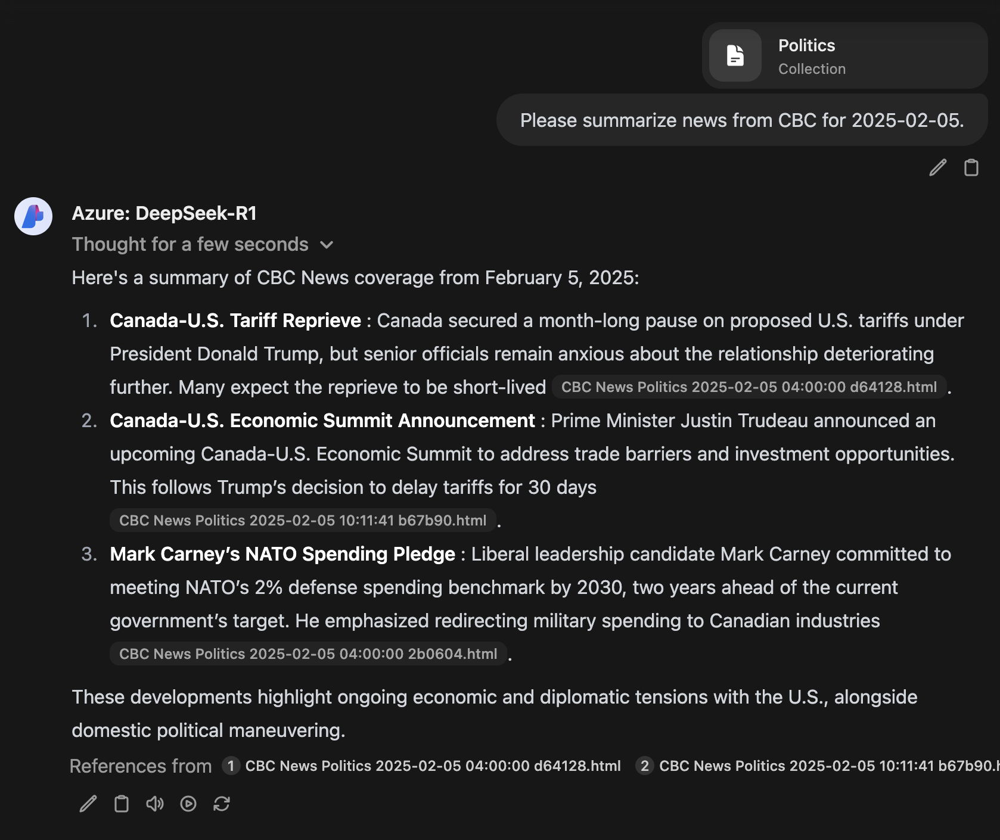

# RSS RAG Ingest Tool

This is a tool for pulling content from RSS feeds and submitting articles to an Open-WebUI Knowledge Base.

Those articles can then be queried. The quality of information produced is entirely dependent on your embedding model and the model you choose to query.

## Installation/Building

This installation makes use of CGO and therefore needs a C build environment available. Check out `build-crosscompile.sh` for an example of how to build for a different platform from the one you're using.

Further details on dependencies and prerequisites can be found in the README at https://github.com/mattn/go-sqlite3.

## Configuration

The config file is hard-coded for the moment to be at `./config.yml`. Copy `config-example.yml` to `config.yml` and modify the configuration to suit your needs.

The `rss` items are, I hope, pretty straightforward but I'll spell out schema here:

* `id`: lowercase, no spaces ID of the rss feed for purposes of tracking in the database. Do not change this after initial setup or you'll get repeat file uploads to Open-WebUI.
* `name`: plaintext name for the feed as it appears in the uploaded filename. No special characters allowed.
* `url`: Direct URL for the RSS feed.
* `data_in_link`: This is a boolean value that tells the tool whether to follow the link in the RSS. If `false` the tool will generate a markdown file containing details about the RSS entry and submit that (useful for microblogs) instead of following the link.
* `author_override` (optional): If entered, this will override the value in the RSS author tags. Useful if the author tags are empty and need to be attributed.
* `html_to_markdown`: Using [jaytaylor](https://github.com/jaytaylor)'s amazing [html2text](https://github.com/jaytaylor/html2text) library, this setting converts an html document to nicely formatted markdown.
* `owui_knowledge_base`: The ID of your knowledge base in Open-WebUI. This is the UUID string as it appears in the URL, not the name.
